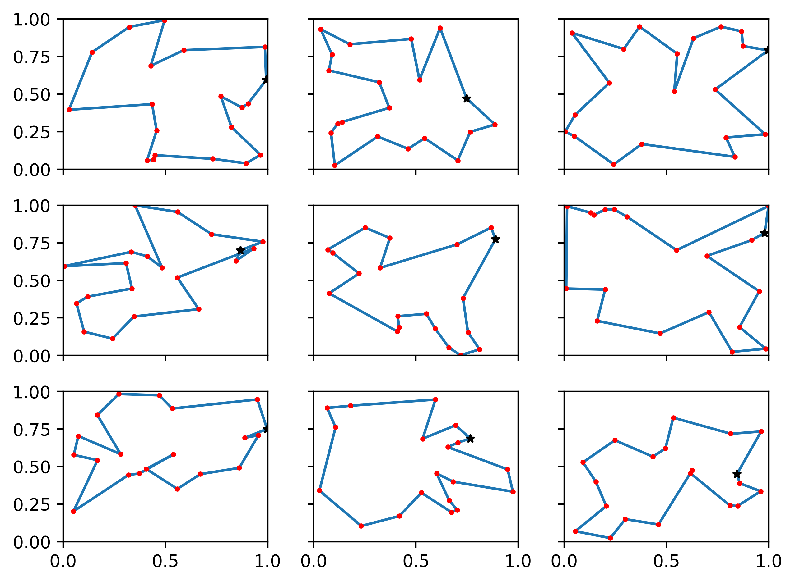

# pytorch-drl4vrp

Implementation of: Nazari, Mohammadreza, et al. "Deep Reinforcement Learning for Solving the Vehicle Routing Problem." arXiv preprint arXiv:1802.04240 (2018).

Currently, Traveling Salesman Problems and Vehicle Routing Problems are supported. See the _tasks/_ folder for details.

## Requirements:

* Python 3.6
* pytorch=0.4.1
* matplotlib

# To Run

Run by calling ```python trainer.py```

Tasks and complexity can be changed through the "task" and "nodes" flag:

```python trainer.py --task=vrp --nodes=10```

To restore a checkpoint, you must specify the path to a folder that has "actor.pt" and "critic.pt" checkpoints. Sample weights can be found [here](https://drive.google.com/open?id=1wxccGStVglspW-qIpUeMPXAGHh2HsFpF)

```python trainer.py --task=vrp --nodes=10 --checkpoint=vrp10```
## Differences from paper:

* Uses a GRU instead of LSTM for the decoder network
* Critic takes the raw static and dynamic input states and predicts a reward
* Use demand scaling (MAX_DEMAND / MAX_VEHICLE_CAPACITY), and give the depot for the VRP a negative value proportionate to the missing capacity (Unsure if used or not)

## TSP Sample Tours:

__Left__: TSP with 20 cities 

__Right__: TSP with 50 cities

<p align="center">
  
  
</p>

## VRP Sample Tours:

__Left__: VRP with 10 cities + load 20 

__Right__: VRP with 20 cities + load 30

<p align="center">
  
  
</p>


# TSP

The following masking scheme is used for the TSP:
1. If a salesman has visited a city, it is not allowed to re-visit it. 

# VRP

The VRP deals with dynamic elements (load 'L', demand 'D') that change everytime the vehicle / salesman visits a city. Each city is randomly generated with random demand in the range [1, 9]. The salesman has an initial capacity that changes with the complexity of the problem (e.g. number of nodes)

The following __masking scheme__ is used for the VRP:
1. If there is no demand remaining at any city, end the tour. Note this means that the vehicle must return to the depot to complete
2. The vehicle can visit any city, as long as it is able to fully satisfy demand (easy to modify for partial trips if needed)
3. The vehicle may not visit the depot more then once in a row (to speed up training)
4. A vehicle may only visit the depot twice or more in a row if it has completed its route and waiting for other vehicles to finish (e.g. training in a minibatch setting) 

In this project the following dynamic updates are used:
1. If a vehicle visits a city, its load changes according to: Load = Load - Demand_i, and the demand at the city changes according to: Demand_i = (Demand_i - load)+
2. Returning to the vehicle refills the vehicles load. The depot is given a "negative" demand that increases proportional to the amount of load missing from the vehicle

# Results:

## Tour Accuracy

This repo only implements the "Greedy" approach during test time, which selects the city with the highest probability. Tour length comparing this project to the corresponding paper is reported below. Differences in tour length may likely be optimized further through hyperparameter search, which has not been conducted here. 

|               | Paper ("Greedy") | This  |
|---------------|------------------|-------|
| TSP20         | 3.97             | 4.032 |
| TSP50         | 6.08             | 6.226 |
| TSP100        | 8.44             |       |
| VRP10 Cap 20  | 4.84             | 5.082 |
| VRP20 Cap 30  | 6.59             | 6.904 |
| VRP50 Cap 40  | 11.39            |       |
| VRP100 Cap 50 | 17.23            |       |

## Training Time

On a Tesla P-100 GPU, the following training times are observed. Results were obtained by taking the the total time for the first 100 training iterations (with respective batch sizes), and converting into the appopriate time unit. Note that for the VRP in particular, as models are relatively untrained during this time, this may be slightly inaccurate results and YMMV. 

| Task   | Batch Size | Sec / 100 Updates | Min / Epoch | Hours/Epoch | 20 Epochs |
|--------|------------|-------------------|-------------|-------------|-----------|
| TSP20  | 128        | 8.23              | 10.71       | 0.18        | 3.57      |
| TSP20  | 256        | 11.90             | 7.75        | 0.13        | 2.58      |
| TSP20  | 512        | 19.10             | 6.22        | 0.10        | 2.07      |
| TSP50  | 128        | 21.64             | 28.17       | 0.47        | 9.39      |
| TSP50  | 256        | 31.33             | 20.40       | 0.34        | 6.80      |
| TSP50  | 512        | 51.70             | 16.83       | 0.28        | 5.61      |
| TSP100 | 128        | 48.27             | 62.85       | 1.05        | 20.95     |
| TSP100 | 256        | 73.51             | 47.85       | 0.80        | 15.95     |

| Task   | Batch Size | Sec / 100 Updates | Min / Epoch | Hours/Epoch | 20 Epochs |
|--------|------------|-------------------|-------------|-------------|-----------|
| VRP10  | 128        | 12.15             | 15.82       | 0.26        | 5.27      |
| VRP10  | 256        | 15.75             | 10.25       | 0.17        | 3.42      |
| VRP10  | 512        | 23.30             | 7.58        | 0.13        | 2.53      |
| VRP20  | 128        | 21.45             | 27.93       | 0.47        | 9.31      |
| VRP20  | 256        | 28.29             | 18.42       | 0.31        | 6.14      |
| VRP20  | 512        | 43.20             | 14.06       | 0.23        | 4.69      |
| VRP50  | 128        | 53.59             | 69.77       | 1.16        | 23.26     |
| VRP50  | 256        | 77.25             | 50.29       | 0.84        | 16.76     |
| VRP50  | 512        | 127.73            | 41.58       | 0.69        | 13.86     |
| VRP100 | 128        | 130.06            | 169.35      | 2.82        | 56.45     |
| VRP100 | 64         | 95.03             | 247.48      | 4.12        | 82.49     |

# Acknowledgements:

Thanks to https://github.com/pemami4911/neural-combinatorial-rl-pytorch for insight on bug with random number generator on GPU
